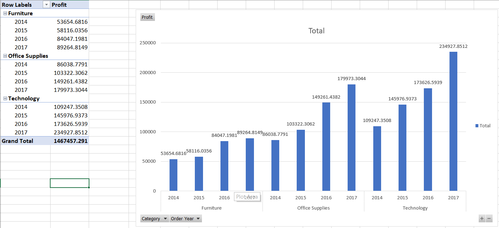
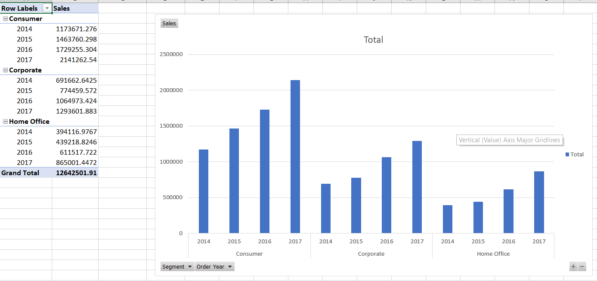

# Analyze data by SSAS

## After build cube, we browse cube to analyze and statistics

### Some charts show statistical results using the Analyze in Excel function
1. The chart shows profit by year and by product category

2. The chart shows sales by year and by customer type
